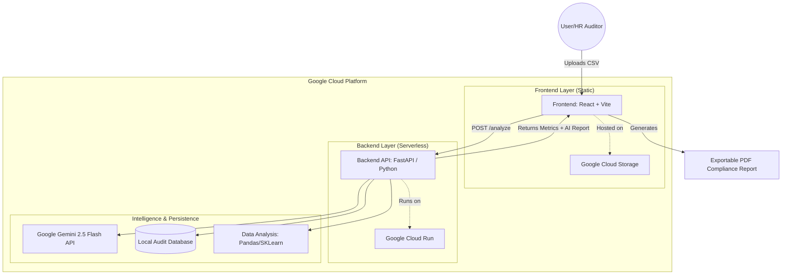

# FairHire AI: System Architecture

The following diagram illustrates the enterprise-grade architecture of the **FairHire AI Bias Auditor**, optimized for Google Cloud deployment.

## Component Breakdown

1.  **Frontend (React/Vite)**: A high-end glassmorphic dashboard built with Framer Motion and Recharts for visual impact.
2.  **Backend (FastAPI)**: A robust Python API specialized in demographic fairness auditing.
3.  **Bias Analysis (Pandas/SKLearn)**: Uses Disparate Impact and Statistical Parity metrics to quantify bias levels.
4.  **Generative AI (Gemini)**: Provides human-readable ethical explanations and actionable remediation steps.
5.  **Deployment**: Hybrid cloud architecture using serverless components (Cloud Run) and globally scalable static hosting (Cloud Storage).
